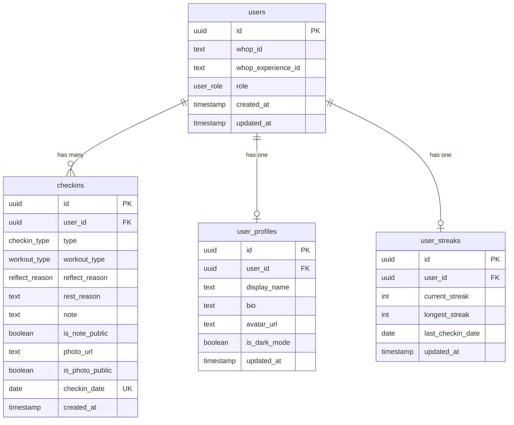

# FitCom Supabase Database Schema

> **Backend**: Supabase (PostgreSQL + Storage)  
> **User Scope**: Users are unique per `(whop_id, whop_experience_id)` — same Whop user can exist in multiple communities  
> **Version**: 1.1

---

## Overview

This document defines the complete database schema for the FitCom fitness accountability platform. All user data is organized using their WhopID as the primary identifier, scoped per community (experience).

> [!IMPORTANT]
> Users are scoped by **both** `whop_id` AND `whop_experience_id`. This means:
> - The same Whop user joining different communities gets separate FitCom profiles
> - Data is completely isolated between communities
> - Storage paths include experience ID for isolation



---

## Enums

### `user_role`
Defines the role/permissions of a user within the platform.

| Value | Description |
|-------|-------------|
| `member` | Standard user with access to personal features |
| `admin` | Coach/admin with access to dashboard, member tracking, and can delete any check-in |

### `checkin_type`
Types of daily check-ins a user can log.

| Value | Description |
|-------|-------------|
| `workout` | Completed a workout session |
| `rest` | Taking a planned rest day |
| `reflect` | Reflection day (missed workout with reason) |

### `workout_type`
Categorization of workout sessions (used when `checkin_type = 'workout'`).

| Value | Description |
|-------|-------------|
| `push` | Push exercises (chest, shoulders, triceps) |
| `pull` | Pull exercises (back, biceps) |
| `legs` | Lower body workout |
| `upper` | Upper body workout |
| `full_body` | Full body workout |
| `cardio` | Cardiovascular exercise |
| `custom` | User-defined workout |

### `reflect_reason`
Reasons for missing a workout (used when `checkin_type = 'reflect'`).

| Value | Description |
|-------|-------------|
| `sick` | Illness or health issues |
| `injury` | Physical injury preventing workout |
| `travel` | Traveling without gym access |
| `work` | Work obligations or schedule conflict |
| `family` | Family responsibilities |
| `mental_health` | Mental health day |
| `other` | Other reason (specified in note) |

---

## Tables

### `users`

Primary user table linked to Whop authentication. **Unique per community installation.**

| Column | Type | Constraints | Description |
|--------|------|-------------|-------------|
| `id` | `uuid` | `PRIMARY KEY, DEFAULT gen_random_uuid()` | Internal unique identifier |
| `whop_id` | `text` | `NOT NULL` | Whop user ID (e.g., `user_abc123`) |
| `whop_experience_id` | `text` | `NOT NULL` | Whop experience/product ID (community identifier) |
| `role` | `user_role` | `DEFAULT 'member'` | User role for access control |
| `created_at` | `timestamptz` | `DEFAULT now()` | Account creation timestamp |
| `updated_at` | `timestamptz` | `DEFAULT now()` | Last update timestamp |

**Constraints:**
- `UNIQUE(whop_id, whop_experience_id)` — Same user can exist in multiple communities with separate data

**Indexes:**
- `idx_users_whop_lookup` on `(whop_id, whop_experience_id)` (for fast Whop authentication lookups)
- `idx_users_experience` on `whop_experience_id` (for community-wide queries)

**RLS Policies:**
- Users can only read/update their own row (matching both whop_id and experience_id)
- Admins can read all users in their community

> [!NOTE]
> **Why community-scoped users?**  
> When your Whop app is installed in multiple communities, each installation gets its own `whop_experience_id`. By making users unique per `(whop_id, whop_experience_id)`, we ensure:
> 1. Complete data isolation between communities
> 2. Users can have different profiles/settings in each community
> 3. Admins only see members of their own community
> 4. The UUID `id` is auto-generated and globally unique — no custom algorithm needed

---

### `user_profiles`

Extended profile information for each user.

| Column | Type | Constraints | Description |
|--------|------|-------------|-------------|
| `id` | `uuid` | `PRIMARY KEY, DEFAULT gen_random_uuid()` | Unique identifier |
| `user_id` | `uuid` | `REFERENCES users(id) ON DELETE CASCADE, UNIQUE` | Link to users table |
| `display_name` | `text` | `NOT NULL, DEFAULT 'User'` | Public display name |
| `bio` | `text` | `DEFAULT ''` | User bio/description |
| `avatar_url` | `text` | `NULL` | Profile picture URL (Supabase Storage) |
| `is_dark_mode` | `boolean` | `DEFAULT true` | Theme preference |
| `updated_at` | `timestamptz` | `DEFAULT now()` | Last update timestamp |

**Indexes:**
- `idx_user_profiles_user_id` on `user_id`

**RLS Policies:**
- Users can read/update their own profile
- All users in same community can read display_name and avatar_url (for feed)

---

### `checkins`

Daily check-in logs. **Constraint: One check-in per user per day.**

| Column | Type | Constraints | Description |
|--------|------|-------------|-------------|
| `id` | `uuid` | `PRIMARY KEY, DEFAULT gen_random_uuid()` | Unique identifier |
| `user_id` | `uuid` | `REFERENCES users(id) ON DELETE CASCADE` | Link to users table |
| `type` | `checkin_type` | `NOT NULL` | Type of check-in |
| `workout_type` | `workout_type` | `NULL` | Workout category (only for `workout` type) |
| `reflect_reason` | `reflect_reason` | `NULL` | Reason for missing workout (only for `reflect` type) |
| `rest_reason` | `text` | `NULL` | Free-text reason for rest day (only for `rest` type) |
| `note` | `text` | `DEFAULT ''` | Personal notes |
| `is_note_public` | `boolean` | `DEFAULT false` | Show note in community feed |
| `photo_url` | `text` | `NULL` | Check-in photo URL (Supabase Storage) |
| `is_photo_public` | `boolean` | `DEFAULT false` | Show photo in community feed |
| `checkin_date` | `date` | `NOT NULL, DEFAULT CURRENT_DATE` | Date of check-in |
| `created_at` | `timestamptz` | `DEFAULT now()` | Creation timestamp |

**Constraints:**
- `UNIQUE(user_id, checkin_date)` — Enforces one check-in per day per user

**Indexes:**
- `idx_checkins_user_id` on `user_id`
- `idx_checkins_user_date` on `(user_id, checkin_date DESC)` — For user's activity history
- `idx_checkins_public_feed` on `(checkin_date DESC) WHERE is_note_public = true OR is_photo_public = true` — For feed queries

**RLS Policies:**
- Users can CRUD their own check-ins
- All users can read check-ins where `is_note_public = true OR is_photo_public = true`
- Admins can read ALL check-ins in their community
- **Admins can DELETE any check-in in their community**

---

### `user_streaks`

Pre-computed streak data for performance optimization.

| Column | Type | Constraints | Description |
|--------|------|-------------|-------------|
| `id` | `uuid` | `PRIMARY KEY, DEFAULT gen_random_uuid()` | Unique identifier |
| `user_id` | `uuid` | `REFERENCES users(id) ON DELETE CASCADE, UNIQUE` | Link to users table |
| `current_streak` | `integer` | `DEFAULT 0` | Current consecutive days |
| `longest_streak` | `integer` | `DEFAULT 0` | All-time best streak |
| `last_checkin_date` | `date` | `NULL` | Date of last check-in |
| `updated_at` | `timestamptz` | `DEFAULT now()` | Last calculation timestamp |

**Indexes:**
- `idx_user_streaks_user_id` on `user_id`

**RLS Policies:**
- Users can read their own streak
- Admins can read all streaks (for dashboard)

---

## Supabase Storage

### Bucket: `checkin-photos`

Stores user check-in photos organized by Experience ID and WhopID.

**Path Structure:**
```
checkin-photos/
└── {whop_experience_id}/
    └── {whop_id}/
        └── {YYYY-MM-DD}_{checkin_type}.{ext}
```

**Example:**
```
checkin-photos/exp_xyz789/user_abc123/2025-12-14_workout.webp
```

**Policies:**
- Users can upload/read/delete only files in their `{experience_id}/{whop_id}/` folder
- Public read access for photos where `is_photo_public = true` (via signed URLs)

### Bucket: `avatars`

Stores user profile avatars organized by Experience ID and WhopID.

**Path Structure:**
```
avatars/
└── {whop_experience_id}/
    └── {whop_id}/
        └── avatar.{ext}
```

**Example:**
```
avatars/exp_xyz789/user_abc123/avatar.webp
```

**Policies:**
- Users can upload/read/delete only their own avatar
- All authenticated users in same community can read any avatar (for feed display)

---

## SQL Migration Script

```sql
-- =====================================
-- ENUMS
-- =====================================

CREATE TYPE user_role AS ENUM ('member', 'admin');
CREATE TYPE checkin_type AS ENUM ('workout', 'rest', 'reflect');
CREATE TYPE workout_type AS ENUM ('push', 'pull', 'legs', 'upper', 'full_body', 'cardio', 'custom');
CREATE TYPE reflect_reason AS ENUM ('sick', 'injury', 'travel', 'work', 'family', 'mental_health', 'other');

-- =====================================
-- TABLES
-- =====================================

-- Users table (unique per community)
CREATE TABLE users (
    id UUID PRIMARY KEY DEFAULT gen_random_uuid(),
    whop_id TEXT NOT NULL,
    whop_experience_id TEXT NOT NULL,
    role user_role DEFAULT 'member',
    created_at TIMESTAMPTZ DEFAULT now(),
    updated_at TIMESTAMPTZ DEFAULT now(),
    
    -- Same user can exist in multiple communities
    CONSTRAINT unique_user_per_community UNIQUE(whop_id, whop_experience_id)
);

CREATE INDEX idx_users_whop_lookup ON users(whop_id, whop_experience_id);
CREATE INDEX idx_users_experience ON users(whop_experience_id);

-- User profiles table
CREATE TABLE user_profiles (
    id UUID PRIMARY KEY DEFAULT gen_random_uuid(),
    user_id UUID UNIQUE REFERENCES users(id) ON DELETE CASCADE,
    display_name TEXT NOT NULL DEFAULT 'User',
    bio TEXT DEFAULT '',
    avatar_url TEXT,
    is_dark_mode BOOLEAN DEFAULT true,
    updated_at TIMESTAMPTZ DEFAULT now()
);

CREATE INDEX idx_user_profiles_user_id ON user_profiles(user_id);

-- Check-ins table
CREATE TABLE checkins (
    id UUID PRIMARY KEY DEFAULT gen_random_uuid(),
    user_id UUID REFERENCES users(id) ON DELETE CASCADE,
    type checkin_type NOT NULL,
    workout_type workout_type,
    reflect_reason reflect_reason,
    rest_reason TEXT,
    note TEXT DEFAULT '',
    is_note_public BOOLEAN DEFAULT false,
    photo_url TEXT,
    is_photo_public BOOLEAN DEFAULT false,
    checkin_date DATE NOT NULL DEFAULT CURRENT_DATE,
    created_at TIMESTAMPTZ DEFAULT now(),
    
    -- One check-in per user per day
    CONSTRAINT unique_user_checkin_per_day UNIQUE(user_id, checkin_date)
);

CREATE INDEX idx_checkins_user_id ON checkins(user_id);
CREATE INDEX idx_checkins_user_date ON checkins(user_id, checkin_date DESC);
CREATE INDEX idx_checkins_public_feed ON checkins(checkin_date DESC) 
    WHERE is_note_public = true OR is_photo_public = true;

-- User streaks table
CREATE TABLE user_streaks (
    id UUID PRIMARY KEY DEFAULT gen_random_uuid(),
    user_id UUID UNIQUE REFERENCES users(id) ON DELETE CASCADE,
    current_streak INTEGER DEFAULT 0,
    longest_streak INTEGER DEFAULT 0,
    last_checkin_date DATE,
    updated_at TIMESTAMPTZ DEFAULT now()
);

CREATE INDEX idx_user_streaks_user_id ON user_streaks(user_id);

-- =====================================
-- TRIGGERS
-- =====================================

-- Auto-update updated_at timestamp
CREATE OR REPLACE FUNCTION update_updated_at()
RETURNS TRIGGER AS $$
BEGIN
    NEW.updated_at = now();
    RETURN NEW;
END;
$$ LANGUAGE plpgsql;

CREATE TRIGGER users_updated_at
    BEFORE UPDATE ON users
    FOR EACH ROW EXECUTE FUNCTION update_updated_at();

CREATE TRIGGER user_profiles_updated_at
    BEFORE UPDATE ON user_profiles
    FOR EACH ROW EXECUTE FUNCTION update_updated_at();

CREATE TRIGGER user_streaks_updated_at
    BEFORE UPDATE ON user_streaks
    FOR EACH ROW EXECUTE FUNCTION update_updated_at();

-- Auto-create profile and streak records when user is created
CREATE OR REPLACE FUNCTION create_user_defaults()
RETURNS TRIGGER AS $$
BEGIN
    INSERT INTO user_profiles (user_id) VALUES (NEW.id);
    INSERT INTO user_streaks (user_id) VALUES (NEW.id);
    RETURN NEW;
END;
$$ LANGUAGE plpgsql;

CREATE TRIGGER on_user_created
    AFTER INSERT ON users
    FOR EACH ROW EXECUTE FUNCTION create_user_defaults();
```

---

## Row Level Security (RLS) Policies

```sql
-- Enable RLS on all tables
ALTER TABLE users ENABLE ROW LEVEL SECURITY;
ALTER TABLE user_profiles ENABLE ROW LEVEL SECURITY;
ALTER TABLE checkins ENABLE ROW LEVEL SECURITY;
ALTER TABLE user_streaks ENABLE ROW LEVEL SECURITY;

-- =====================================
-- HELPER FUNCTION: Get current user's info from JWT
-- =====================================

CREATE OR REPLACE FUNCTION get_current_user_info()
RETURNS TABLE (user_id UUID, whop_id TEXT, experience_id TEXT, role user_role) AS $$
BEGIN
    RETURN QUERY
    SELECT u.id, u.whop_id, u.whop_experience_id, u.role
    FROM users u
    WHERE u.whop_id = current_setting('request.jwt.claims', true)::json->>'whop_id'
      AND u.whop_experience_id = current_setting('request.jwt.claims', true)::json->>'experience_id';
END;
$$ LANGUAGE plpgsql SECURITY DEFINER;

-- =====================================
-- USERS POLICIES
-- =====================================

-- Users can read their own data
CREATE POLICY "Users can read own data"
    ON users FOR SELECT
    USING (
        whop_id = current_setting('request.jwt.claims', true)::json->>'whop_id'
        AND whop_experience_id = current_setting('request.jwt.claims', true)::json->>'experience_id'
    );

-- Admins can read all users in their community
CREATE POLICY "Admins can read community users"
    ON users FOR SELECT
    USING (
        whop_experience_id = current_setting('request.jwt.claims', true)::json->>'experience_id'
        AND EXISTS (
            SELECT 1 FROM users 
            WHERE whop_id = current_setting('request.jwt.claims', true)::json->>'whop_id'
            AND whop_experience_id = current_setting('request.jwt.claims', true)::json->>'experience_id'
            AND role = 'admin'
        )
    );

-- =====================================
-- USER_PROFILES POLICIES
-- =====================================

-- Users can manage their own profile
CREATE POLICY "Users can manage own profile"
    ON user_profiles FOR ALL
    USING (
        user_id = (SELECT user_id FROM get_current_user_info() LIMIT 1)
    );

-- All authenticated users can read profiles in their community
CREATE POLICY "Community can read profiles"
    ON user_profiles FOR SELECT
    USING (
        user_id IN (
            SELECT id FROM users 
            WHERE whop_experience_id = current_setting('request.jwt.claims', true)::json->>'experience_id'
        )
    );

-- =====================================
-- CHECKINS POLICIES
-- =====================================

-- Users can manage their own check-ins
CREATE POLICY "Users can manage own checkins"
    ON checkins FOR ALL
    USING (
        user_id = (SELECT user_id FROM get_current_user_info() LIMIT 1)
    );

-- Anyone in community can read public check-ins
CREATE POLICY "Public checkins are readable"
    ON checkins FOR SELECT
    USING (
        (is_note_public = true OR is_photo_public = true)
        AND user_id IN (
            SELECT id FROM users 
            WHERE whop_experience_id = current_setting('request.jwt.claims', true)::json->>'experience_id'
        )
    );

-- Admins can read all check-ins in their community
CREATE POLICY "Admins can read all community checkins"
    ON checkins FOR SELECT
    USING (
        user_id IN (
            SELECT id FROM users 
            WHERE whop_experience_id = current_setting('request.jwt.claims', true)::json->>'experience_id'
        )
        AND EXISTS (
            SELECT 1 FROM get_current_user_info() WHERE role = 'admin'
        )
    );

-- Admins can DELETE any check-in in their community
CREATE POLICY "Admins can delete any community checkin"
    ON checkins FOR DELETE
    USING (
        user_id IN (
            SELECT id FROM users 
            WHERE whop_experience_id = current_setting('request.jwt.claims', true)::json->>'experience_id'
        )
        AND EXISTS (
            SELECT 1 FROM get_current_user_info() WHERE role = 'admin'
        )
    );

-- =====================================
-- USER_STREAKS POLICIES
-- =====================================

-- Users can read their own streak
CREATE POLICY "Users can read own streak"
    ON user_streaks FOR SELECT
    USING (
        user_id = (SELECT user_id FROM get_current_user_info() LIMIT 1)
    );

-- Admins can read all streaks in their community
CREATE POLICY "Admins can read community streaks"
    ON user_streaks FOR SELECT
    USING (
        user_id IN (
            SELECT id FROM users 
            WHERE whop_experience_id = current_setting('request.jwt.claims', true)::json->>'experience_id'
        )
        AND EXISTS (
            SELECT 1 FROM get_current_user_info() WHERE role = 'admin'
        )
    );
```

---

## Database Functions

### `update_user_streak`

Called after a check-in to update streak calculations.

```sql
CREATE OR REPLACE FUNCTION update_user_streak(p_user_id UUID)
RETURNS void AS $$
DECLARE
    v_last_date DATE;
    v_current_streak INTEGER;
    v_longest_streak INTEGER;
    v_today DATE := CURRENT_DATE;
BEGIN
    -- Get current streak data
    SELECT last_checkin_date, current_streak, longest_streak
    INTO v_last_date, v_current_streak, v_longest_streak
    FROM user_streaks
    WHERE user_id = p_user_id;
    
    -- Calculate new streak
    IF v_last_date IS NULL THEN
        -- First ever check-in
        v_current_streak := 1;
    ELSIF v_last_date = v_today THEN
        -- Already checked in today, no change
        RETURN;
    ELSIF v_last_date = v_today - INTERVAL '1 day' THEN
        -- Consecutive day
        v_current_streak := v_current_streak + 1;
    ELSE
        -- Streak broken
        v_current_streak := 1;
    END IF;
    
    -- Update longest streak if current exceeds it
    IF v_current_streak > v_longest_streak THEN
        v_longest_streak := v_current_streak;
    END IF;
    
    -- Save updated streak
    UPDATE user_streaks
    SET current_streak = v_current_streak,
        longest_streak = v_longest_streak,
        last_checkin_date = v_today,
        updated_at = now()
    WHERE user_id = p_user_id;
END;
$$ LANGUAGE plpgsql;
```

### `get_or_create_user`

Finds or creates a user by their Whop ID and Experience ID.

```sql
CREATE OR REPLACE FUNCTION get_or_create_user(
    p_whop_id TEXT,
    p_whop_experience_id TEXT
)
RETURNS TABLE (
    id UUID,
    whop_id TEXT,
    whop_experience_id TEXT,
    role user_role,
    is_new BOOLEAN
) AS $$
DECLARE
    v_user_id UUID;
    v_is_new BOOLEAN := false;
BEGIN
    -- Try to find existing user
    SELECT u.id INTO v_user_id
    FROM users u
    WHERE u.whop_id = p_whop_id 
      AND u.whop_experience_id = p_whop_experience_id;
    
    -- Create if not exists
    IF v_user_id IS NULL THEN
        INSERT INTO users (whop_id, whop_experience_id)
        VALUES (p_whop_id, p_whop_experience_id)
        RETURNING users.id INTO v_user_id;
        v_is_new := true;
    ELSE
        -- Update last seen
        UPDATE users SET updated_at = now() WHERE users.id = v_user_id;
    END IF;
    
    RETURN QUERY
    SELECT u.id, u.whop_id, u.whop_experience_id, u.role, v_is_new
    FROM users u
    WHERE u.id = v_user_id;
END;
$$ LANGUAGE plpgsql;
```

---

## API Patterns

### User Path Pattern

All user-specific data follows the community + WhopID path:

| Resource | Path Pattern |
|----------|--------------|
| User lookup | `users` → filter by `(whop_id, whop_experience_id)` |
| Profile | `user_profiles` → join via `user_id` |
| Check-ins | `checkins` → filter by `user_id` |
| Streaks | `user_streaks` → filter by `user_id` |
| Photos | `checkin-photos/{experience_id}/{whop_id}/...` |
| Avatar | `avatars/{experience_id}/{whop_id}/avatar.{ext}` |

### Typical Queries

```typescript
// Get user by Whop ID + Experience ID
const { data: user } = await supabase
  .from('users')
  .select('*, user_profiles(*), user_streaks(*)')
  .eq('whop_id', whopId)
  .eq('whop_experience_id', experienceId)
  .single();

// Get user's check-ins
const { data: checkins } = await supabase
  .from('checkins')
  .select('*')
  .eq('user_id', userId)
  .order('checkin_date', { ascending: false });

// Get public feed for community
const { data: feed } = await supabase
  .from('checkins')
  .select(`
    *,
    users!inner(whop_id, whop_experience_id),
    user_profiles!inner(display_name, avatar_url)
  `)
  .eq('users.whop_experience_id', experienceId)
  .or('is_note_public.eq.true,is_photo_public.eq.true')
  .order('checkin_date', { ascending: false })
  .limit(50);

// Coach dashboard: Get all members in community
const { data: members } = await supabase
  .from('users')
  .select('*, user_profiles(*), user_streaks(*)')
  .eq('whop_experience_id', experienceId)
  .eq('role', 'member');

// Admin: Delete any check-in
const { error } = await supabase
  .from('checkins')
  .delete()
  .eq('id', checkinId);
```

---

## Implementation Guide

> [!IMPORTANT]
> Follow these steps in order. Each step builds on the previous one.

### Phase 1: Supabase Project Setup

#### Step 1.1: Create Supabase Project
1. Go to [supabase.com](https://supabase.com) → **New Project**
2. Choose organization, enter project name: `fitcom-prod` (or `fitcom-dev` for development)
3. Generate and **save your database password** securely
4. Select region closest to your users
5. Wait for project to provision (~2 minutes)

#### Step 1.2: Get Connection Details
1. Go to **Settings → API**
2. Copy these values to your `.env.local`:
   ```env
   NEXT_PUBLIC_SUPABASE_URL=https://your-project.supabase.co
   NEXT_PUBLIC_SUPABASE_ANON_KEY=eyJ...
   SUPABASE_SERVICE_ROLE_KEY=eyJ... (keep secret, server-side only)
   ```

#### Step 1.3: Run Migration Script
1. Go to **SQL Editor** in Supabase dashboard
2. Create new query
3. Paste the complete SQL Migration Script from this document
4. Click **Run** — all tables, enums, triggers will be created

#### Step 1.4: Run RLS Policies Script
1. Create another new query in SQL Editor
2. Paste the complete RLS Policies script
3. Click **Run**

#### Step 1.5: Run Database Functions Script
1. Create another new query
2. Paste both database functions (`update_user_streak` and `get_or_create_user`)
3. Click **Run**

---

### Phase 2: Storage Buckets

#### Step 2.1: Create Buckets
1. Go to **Storage** in Supabase dashboard
2. Click **New bucket**
3. Create bucket: `checkin-photos` (Private)
4. Create bucket: `avatars` (Private)

#### Step 2.2: Configure Storage Policies
1. Click on `checkin-photos` bucket → **Policies**
2. Add policy for INSERT:
   ```sql
   -- Users can upload to their folder
   CREATE POLICY "Users can upload own photos"
   ON storage.objects FOR INSERT
   WITH CHECK (
     bucket_id = 'checkin-photos'
     AND (storage.foldername(name))[1] = current_setting('request.jwt.claims', true)::json->>'experience_id'
     AND (storage.foldername(name))[2] = current_setting('request.jwt.claims', true)::json->>'whop_id'
   );
   ```
3. Add similar policies for SELECT and DELETE
4. Repeat for `avatars` bucket

---

### Phase 3: Next.js Integration

#### Step 3.1: Install Supabase Client
```bash
npm install @supabase/supabase-js @supabase/ssr
```

#### Step 3.2: Create Supabase Client
Create `lib/supabase/client.ts`:
```typescript
import { createBrowserClient } from '@supabase/ssr'

export function createClient() {
  return createBrowserClient(
    process.env.NEXT_PUBLIC_SUPABASE_URL!,
    process.env.NEXT_PUBLIC_SUPABASE_ANON_KEY!
  )
}
```

Create `lib/supabase/server.ts`:
```typescript
import { createServerClient } from '@supabase/ssr'
import { cookies } from 'next/headers'

export async function createClient() {
  const cookieStore = await cookies()
  
  return createServerClient(
    process.env.NEXT_PUBLIC_SUPABASE_URL!,
    process.env.NEXT_PUBLIC_SUPABASE_ANON_KEY!,
    {
      cookies: {
        getAll() {
          return cookieStore.getAll()
        },
        setAll(cookiesToSet) {
          cookiesToSet.forEach(({ name, value, options }) => {
            cookieStore.set(name, value, options)
          })
        },
      },
    }
  )
}
```

#### Step 3.3: Create Database Types
Run Supabase CLI to generate types:
```bash
npx supabase gen types typescript --project-id your-project-id > lib/supabase/database.types.ts
```

---

### Phase 4: Whop Integration

#### Step 4.1: User Initialization Flow
When a user accesses your Whop app:
1. Whop SDK provides `userId` and `experienceId`
2. Call `get_or_create_user(whop_id, experience_id)` RPC
3. Store user's internal `id` in session/context
4. Use internal `id` for all subsequent queries

#### Step 4.2: Role Management
- Default role is `member`
- To make someone admin, update directly in Supabase:
  ```sql
  UPDATE users 
  SET role = 'admin' 
  WHERE whop_id = 'user_ABC123' 
    AND whop_experience_id = 'exp_XYZ789';
  ```
- Or create an admin management UI (only accessible to existing admins)

---

### Phase 5: API Routes

#### Step 5.1: Create Check-in API
Create `app/api/checkin/route.ts` for:
- `POST /api/checkin` — Create check-in
- `PUT /api/checkin/[id]` — Update check-in
- `DELETE /api/checkin/[id]` — Delete check-in (RLS handles permissions)

#### Step 5.2: Create Feed API
Create `app/api/feed/route.ts` for:
- `GET /api/feed` — Get public feed (RLS handles community scoping)

#### Step 5.3: Create Coach API
Create `app/api/coach/members/route.ts` for:
- `GET /api/coach/members` — Get all members (RLS ensures only admins can access)

---

### Phase 6: Frontend Integration

#### Step 6.1: Update Types
Update `types.ts` to match database schema:
```typescript
export type CheckinType = 'workout' | 'rest' | 'reflect';
export type WorkoutType = 'push' | 'pull' | 'legs' | 'upper' | 'full_body' | 'cardio' | 'custom';
export type ReflectReason = 'sick' | 'injury' | 'travel' | 'work' | 'family' | 'mental_health' | 'other';
export type UserRole = 'member' | 'admin';
```

#### Step 6.2: Connect Components
Replace mock data in `App.tsx` with Supabase queries:
- `feedItems` → fetch from `checkins` with public filter
- `myActivities` → fetch from `checkins` for current user
- `userProfile` → fetch from `user_profiles`

---

### Verification Checklist

After completing all phases, verify:

- [ ] Tables created in Supabase → **SQL Editor** → Run `SELECT * FROM users LIMIT 1;`
- [ ] RLS working → Try accessing data without auth (should fail)
- [ ] User creation → Call `get_or_create_user` RPC
- [ ] Storage upload → Upload test image to `checkin-photos/{exp}/{user}/test.jpg`
- [ ] Check-in creation → Insert into `checkins` table
- [ ] Feed query → Query public check-ins, verify only public ones returned
- [ ] Admin read → As admin, verify you can see all check-ins
- [ ] Admin delete → As admin, verify you can delete any check-in
- [ ] Streak update → After check-in, verify `user_streaks` updated
